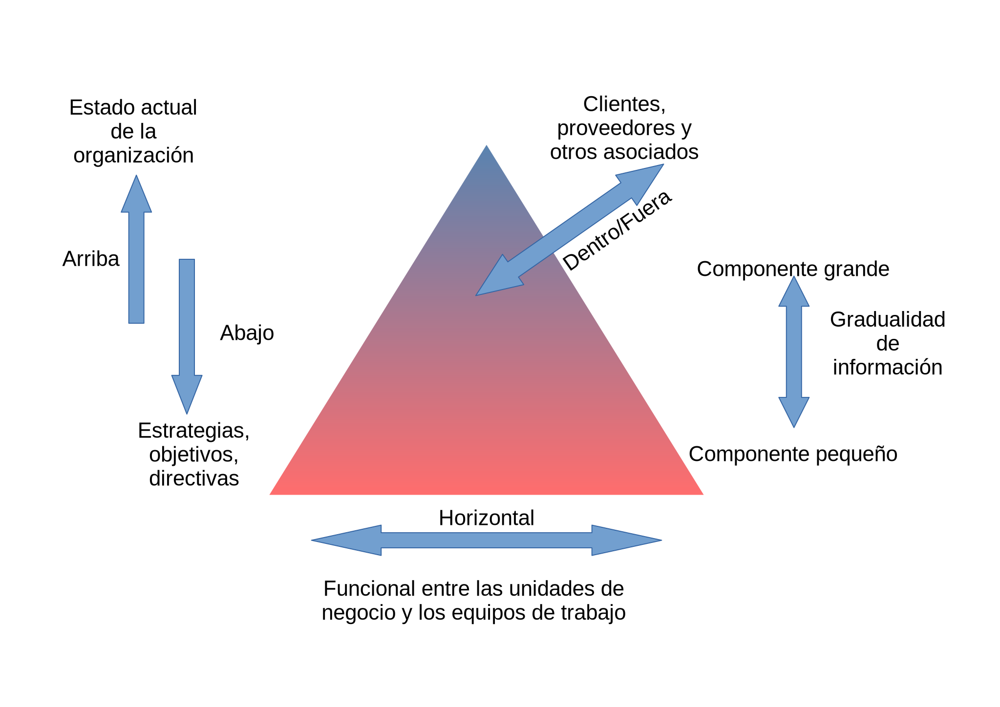
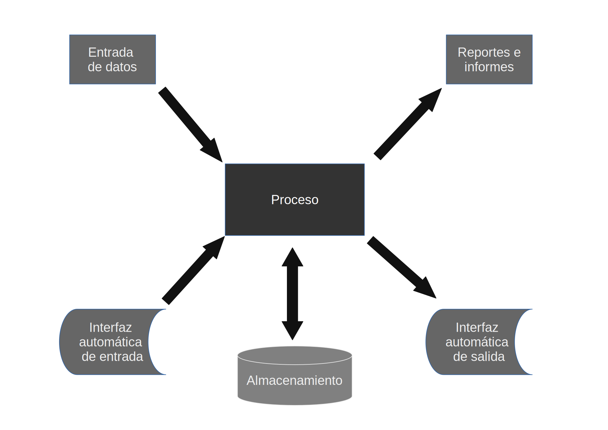
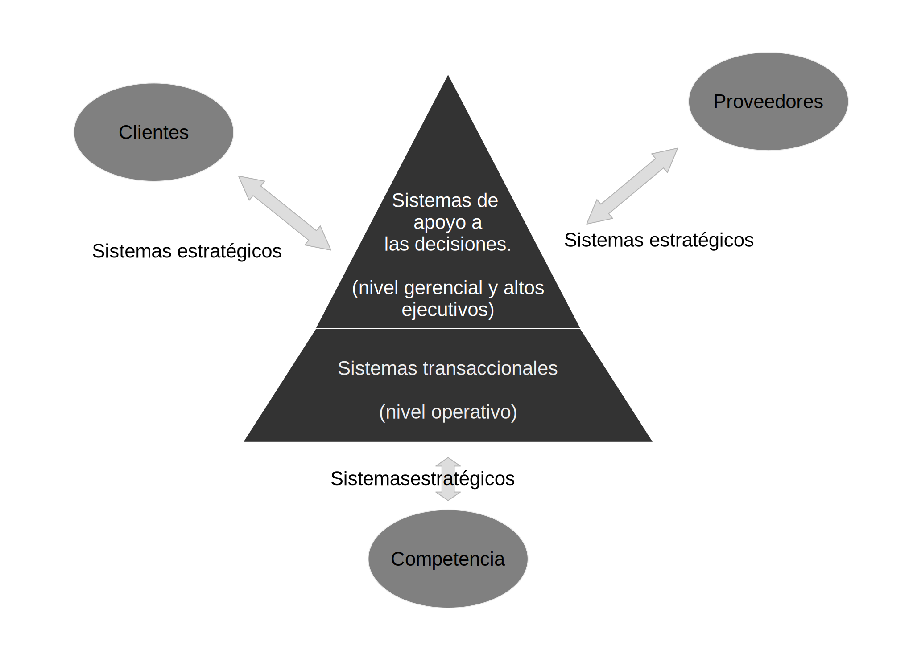
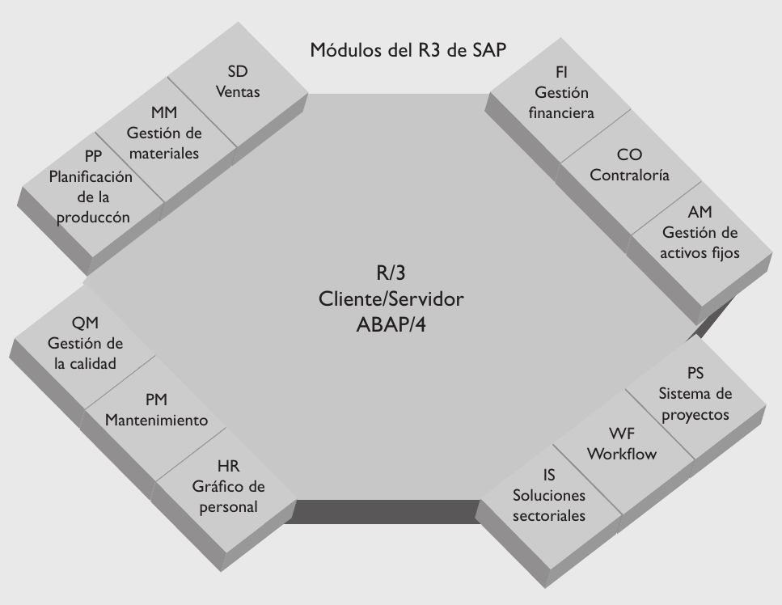
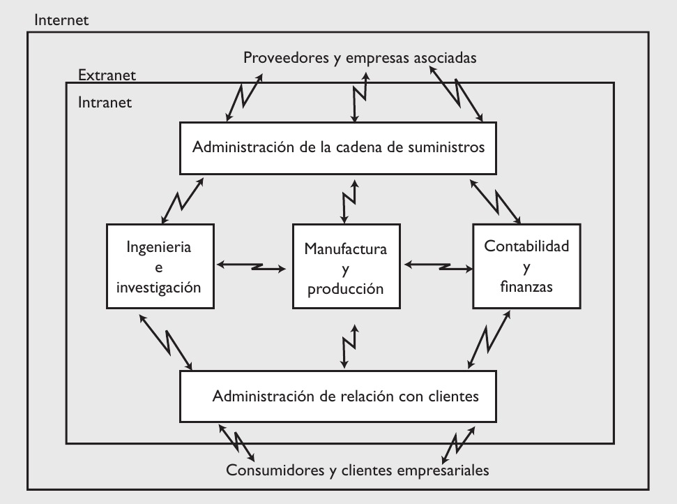
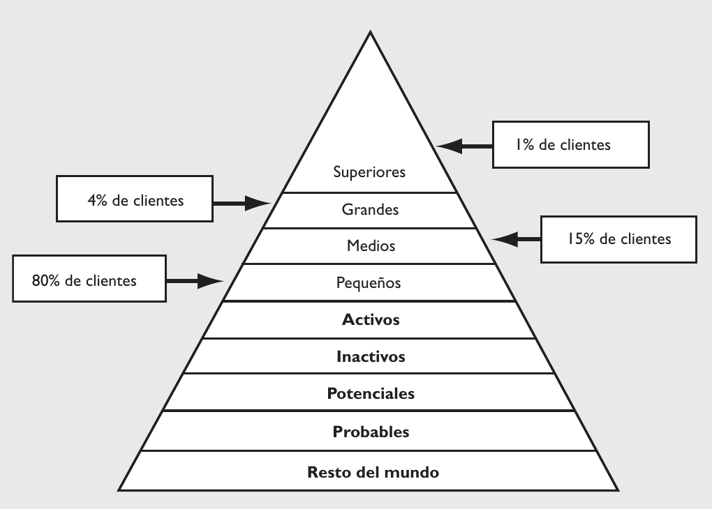

## Introducción

Las Tecnologías de la Información (TI, en lo sucesivo) se consideran en la actualidad como una herramienta de las organizaciones, incluso a la par de la contabilidad, finanzas, recursos humanos, logística y operaciones. Por lo anterior, se les considera vitales en el éxito de los negocios y las organizaciones ya que han cambiado, para bien, la forma en la que éstos operan. ¿Cómo lo consiguen? Pues automatizando procesos operativos que proporcionan información para la toma de decisiones, lo que desemboca en ventajas competitivas.

## Definiciones

__Dato:__ Puede ser una palabra, un número o una imagen que no necesariamente se encuentra en contexto. Por sí solo no aporta mucho y se le considera la materia prima para la obtención de información.

__Información:__ Se le considera así a un conjunto de datos que en determinado contexto o después de cierto procesamiento, tienen un significado para alguien. Sin embargo, no toda información se considera de calidad. Para ello, la información debe contar con tres dimensiones:

- Dimensión de tiempo:  La información debe estar disponible cuando se necesita, estar actualizada, proveerse con la periodicidad requerida y representar el pasado, el presente y el futuro.

- Dimensión de contenido. La información no debe contener errores, debe ser relevante respecto a lo que se analiza, ser completa, concisa, interna y externa, con un enfoque amplio o centrado y medir el desempeño.

- Dimensión de forma. La información se debe integrar en una forma sencilla, sea detallada o en forma de resumen, debe estar ordenada con base en cierto criterio, y se puede presentar en formatos diferentes: tablas, gráficas, listas y, finalmente, aparecer en diferentes medios: papel, medios digitales, etcétera.

__Sistemas:__ Son el mecanismo para generar información. En la siguiente figura se muestra un ejemplo:

Otra forma de analizar la información es desde la perspectiva organizacional, en la cual
adquiere tres dimensiones:

- Flujo de información. La información en una empresa puede fluir en cuatro sentidos: hacia arriba, hacia abajo, en forma horizontal y hacia fuera de la empresa.

- Detalle de la información. Depende del nivel de uso de la información: para los altos niveles de la empresa se presenta en forma agregada; en caso contrario, se presenta con niveles de especificación; por ejemplo, la información de ventas presenta el desempeño del vendedor por día.

- Tipo de la información. Es lo que describe, y se refiere a: información interna, descripción de aspectos operativos de la organización; información externa, explica situaciones del entorno de la organización; información objetiva, cuantifica y evalúa algo conocido; información subjetiva, intenta describir algo que no es conocido con exactitud.

### Sistema de información

Un sistema de información es un conjunto de elementos que interactúan entre sí con el fin de apoyar las actividades de una empresa o negocio. En un sentido amplio, un sistema de información no necesariamente incluye equipo electrónico (hardware). Sin embargo, en la práctica se utiliza como sinónimo de “sistema de información computarizado”. 

Estos elementos son de naturaleza diversa e incluyen:

- El equipo computacional: es el hardware necesario para que el sistema de información opere. Lo constituyen las computadoras y el equipo periférico.

- El recurso humano que interactúa con el sistema de información: las personas que utilizan el sistema, lo alimentan con datos o utilizan los resultados que genera.

- Los datos o información fuente: son todas las entradas que el sistema necesita para generar la información que se desea. 

- Los programas que ejecuta la computadora y que producen diferentes tipos de resultados: los programas procesan los datos de entrada y generan los resultados que se esperan.

- Las telecomunicaciones: básicamente el hardware y el software que transmiten en forma electrónica texto, datos, imágenes y voz.

- Procedimientos: que incluyen las políticas y reglas de operación, tanto en la parte funcional del proceso de negocio, como los mecanismos para hacer trabajar una aplicación en la computadora.

Un sistema de información realiza cuatro actividades básicas, las cuales se definen a continuación.

-  Entrada de información. Es el ingreso de los datos en el sistema de información. Las entradas pueden ser manuales, las proporciona el usuario, o automáticas, datos o información que provienen o se toman de otros sistemas o módulos, lo que se denomina interfaces automáticas; por ejemplo, en un sistema de control de clientes conviene instalar una interfaz automática de entrada con el sistema de facturación, de modo que cada factura que genera el sistema de facturación entra en el sistema de control de clientes. 

- Almacenamiento de información. Es una de las capacidades más importantes de una computadora, ya que permite al sistema recordar la información guardada en la sesión anterior. Esta información se almacena en estructuras de información denominadas archivos, en su versión simple, y bases de datos, en su modalidad compleja.

- Procesamiento de información. Es la capacidad del sistema de información para efectuar cálculos de acuerdo con una secuencia de operaciones preestablecida. Estos cálculos trabajan con datos de recién ingreso o con datos ya almacenados. Esta característica de los sistemas permite la transformación de datos fuente en información útil, lo que posibilita, entre otras cosas, que quien toma decisiones genere una proyección financiera a partir de los datos que contiene un estado de resultados o un balance general de un año base.

- Salida de información. Es la capacidad de un sistema de información para convertir la información procesada o los datos de entrada en información para el exterior. Las típicas unidades de salida son las impresoras, disquetes, cintas magnéticas, la voz, los graficadores y los plotter, entre otros. Es importante aclarar que la salida de un sistema de información puede constituir la entrada a otro sistema de información o módulo. En este caso también existe una interfaz automática de salida. Por ejemplo, el sistema de control de clientes, al que alimenta el sistema de facturación, tiene una interfaz automática de salida con el sistema de contabilidad, que genera las pólizas contables de los movimientos de los clientes.

A continuación se muestran las actividades de un sistema de información:

## Tipos y usos de los sistemas de información

En la actualidad los sistemas de información cumplen tres objetivos básicos dentro de las organizaciones:

- Automatizan los procesos operativos.

- Proporcionan información que sirve de apoyo en el proceso de toma de decisiones.

- Logran ventajas competitivas a través de su implantación y uso.

Cuando los sistemas de información automatizan los procesos operativos dentro de una organización se les llama _sistemas transaccionales_, ya que su función primordial consiste en procesar transacciones, tales como pagos, cobros, pólizas, entradas, salidas, etcétera.

El complemento de los sistemas transaccionales son los sistemas enfocados a la mejora de la toma de decisiones (OLAP, online analytical processing), cuya función es la manipulación de la información con el fin de apoyar y fundamentar la toma de decisiones. Estos sistemas se agrupan a partir de dos funciones: los que se limitan al análisis de la situación y los que además del análisis de la situación hacen una recomendación sobre la decisión a tomar. En la primera categoría están los sistemas de apoyo a las decisiones (_DSS, decision support
systems_), sistemas para la toma de decisiones en grupo (_GDSS, group decision support systems_) y sistemas de información para ejecutivos (_EIS, executive information systems_). En la segunda categoría se encuentran las tecnologías con inteligencia artificial, como los sistemas
expertos de apoyo a la toma de decisiones (_expert decision support systems_) y herramientas de redes neuronales, que al encontrar los “patrones” de un proceso o conjunto de datos generan recomendaciones para quien toma decisiones.

También existen los sistemas de automatización de oficinas (_OIS, office information systems_), útiles en la mayoría de las empresas para trabajar con documentos. Algunos de los programas considerados en los OIS, son: hojas de cálculo, procesamientos de textos, herramientas para hacer presentaciones, bases de datos y herramientas para el manejo de imágenes.

Otro tipo de sistemas, de acuerdo con su uso u objetivos que cumplen, son los sistemas estratégicos, que buscan desarrollar en las organizaciones ventajas competitivas, a través del uso de la tecnología de información.

A continuación se detallan las principales características de estos tipos de sistemas de información.

### Sistemas transaccionales

Sus principales características son:

- Permitir ahorros significativos de mano de obra, debido a que automatizan tareas operativas de la organización.

- Con frecuencia son el primer tipo de sistemas de información que se implanta en las organizaciones. Primero sirven para apoyar las tareas a nivel operativo de la organización y, a medida que evolucionan, continúan con los mandos intermedios para posteriormente apoyar a la alta administración.

- Tienen una intensa entrada y salida de información aunque sus cálculos y procesos suelen ser poco complejos. Estos sistemas requieren de un arduo manejo de datos para poder realizar sus operaciones y, como resultado, generan grandes volúmenes de información.

- Tienen la propiedad de ser recolectores de información, es decir, a través de ellos se cargan las grandes bases de datos para su posterior utilización. Estos sistemas integran cantidades grandes de la información que se maneja en la organización, la cual será empleada después para apoyar a los mandos intermedios y altos.

- Son fáciles de justificar ante la dirección general, ya que sus beneficios son visibles y cuantificables en el corto plazo. El proceso de justificación se realiza con el cotejo de ingresos y costos.

- Son fácilmente adaptables a paquetes de aplicación que se encuentran en el mercado, ya que automatizan los procesos básicos que, por lo general, son similares o iguales en otras organizaciones. Ejemplos de este tipo de sistemas son facturación, nóminas, cuentas por cobrar,
cuentas por pagar, contabilidad general, conciliaciones bancarias, inventarios, abastecimientos, control de distribución, producción, etcétera.

Una variante de los sistemas transaccionales (TPS, transaction processing system) son los sistemas de integración para clientes; en realidad el término en castellano no es muy utilizado (CIS, customer integrated system), ya que busca poner a disposición de los clientes los sistemas transaccionales de la empresa, el ejemplo más característico es el cajero automático (_ATM, automated teller machine_). En general, la Web ofrece opciones para que la empresa lleve sus servicios-sistemas al cliente o usuario final, como son pagos en línea, registro a eventos y compra de boletos, entre otros. En la figura 1.7 se muestra el concepto de un CIS. 

### Sistemas de apoyo a las decisiones

Las principales características de estos sistemas son las siguientes:

- Se deben introducir después de la implantación de los sistemas transaccionales más relevantes de la empresa, ya que los transaccionales constituyen su plataforma de información.

- La información que generan sirve de apoyo a los mandos intermedios y a la alta administración en el proceso de toma de decisiones. Suelen ser intensivos en cálculos y escasos en entradas y salidas de información, la cual toman de los sistemas transaccionales. Por ejemplo, un modelo de planeación financiera requiere poca información de entrada, pero realiza muchos cálculos durante su proceso. 

- No ahorran mano de obra. Debido a ello, la justificación económica para el desarrollo de estos sistemas es difícil, ya que los beneficios del proyecto de inversión no son inmediatos.

- Son sistemas de información interactivos y amigables, con altos estándares de diseño gráfico y visual.

- Apoyan tomas de decisión que, por su misma naturaleza, son repetitivas y estructuradas, así como las decisiones no repetitivas y no estructuradas. Por ejemplo, un sistema de compra de materiales que indique cuándo debe hacerse un pedido al proveedor o un sistema de simulación de negocios que apoye la decisión de introducir un nuevo producto al mercado.

- Los desarrolla el usuario final, sin la participación operativa de los analistas y programadores del área de informática.

Los sistemasde apoyo a las decisiones se clasifican en:

- DSS (decision support systems), sistemas de apoyo a la toma de decisiones.

- GDSS (group decision support systems), sistemas para la toma de decisiones en grupo.

- EIS (executive information systems), sistemas de información para ejecutivos.

- EDSS (expert decision support systems), sistemas expertos de apoyo a la toma de decisiones.

Este tipo de sistemas aplican para la programación de la producción, la compra de materiales, el flujo de fondos, las proyecciones financieras, los modelos de simulación de negocios, los modelos de inventarios, etc. La figura 1.8 muestra un esquema conceptual de los diferentes sistemas de información en los negocios.

### Sistemas estratégicos

Sus principales características son las siguientes:

- Su función no es automatizar procesos operativos ni proporcionar información para apoyar la toma de decisiones. Sin embargo, este tipo de sistemas puede llevar a cabo esas funciones.

- Su desarrollo es in house, es decir, dentro de la organización, por tanto no se adaptan fácilmente a paquetes disponibles en el mercado.

- Su desarrollo típico es en incrementos. Su evolución dentro de la organización inicia con un proceso o función particular y a partir de ahí se agregan nuevas funciones o procesos.

- Su función es lograr ventajas que los competidores no poseen, tales como ventajas en costos y servicios diferenciados con clientes y proveedores. En este contexto, los sistemas estratégicos son creadores de barreras de entrada al negocio. Por ejemplo, el comercio electrónico es un sistema estratégico, ya que da a las empresas elementos para diferenciar sus productos/servicios y así tener ventajas sobre otras compañías que ofrecen productos similares y no cuentan con este servicio. Si una empresa nueva decide entrar al mercado, tendrá que ofrecer este servicio para poder competir.

- Las ventajas que se obtienen con estos sistemas no son “eternas”, es decir, existe un periodo de vigencia que equivale al tiempo que tardan los competidores en alcanzar las diferencias o ventajas obtenidas por el sistema de información estratégico. Cuando esto sucede, los beneficios generados por el sistema de información estratégico se convierten en estándares de la industria, como en el caso del comercio electrónico, que serán requisitos de infraestructura tecnológica que una compañía debe poseer.

- Apoyan el proceso de innovación de productos y procesos dentro de la empresa, debido a que buscan ventajas respecto de los competidores.

Un ejemplo son los sistemas de administración de la relación con clientes (CRM, customer relationship management) y los sistemas de administración de la cadena de suministros (SCM, supply chain management), pues son prácticas de negocio implementadas a través de tecnologías de información que apoyan o dan forma a la estructura competitiva de la empresa.

## Tecnologías de vanguardia en los negocios

En la década de los ochenta y parte de los noventa los procesos de reingeniería marcaron la pauta en la administración de negocios, generaron una gran incorporación de tecnologías de información en las compañías. Debido a esto, las empresas de consultoría en sistemas de información desarrollaron un gran cúmulo de experiencias en estos procesos. En la actualidad las tecnologías de información de vanguardia para los negocios dan soporte a los procesos de suministro, desarrollo de clientes y administración de todos los procesos de negocio. Este grupo de tecnologías es relevante en el actual contexto de competencia de las empresas. 

### Sistemas integrales de administración (ERP, enterprise resource planning)

En los últimos años se han desarrollado numerosas herramientas para apoyar las actividades de los negocios, tecnologías que permiten automatizar casi en su totalidad los procesos operativos. Así como el MRP es una solución al proceso productivo, un ERP (enterprise resource planning) apoya los procesos básicos funcionales de una empresa. Uno de los sistemas líderes a nivel mundial en esta categoría es el R/3 de SAP. (Vea la dirección de Internet http://www.sap.com) ¿Qué es SAP? (del alemán _systemanalyse and programmentwicklung_). Hoy en día SAP es una de las empresas más grandes de software en el mundo; fue fundada en 1972 en la ciudad de Mannheim, Alemania, por un equipo de empleados de IBM de aquel país, quienes compartieron un proyecto para lograr una solución integrada para cada compañía, con el cual pudieron crear su propia empresa de software. En la actualidad, SAP AG es líder mundial en aplicaciones de negocios en arquitectura cliente/servidor. Como compañía
de software se localiza detrás de Microsoft Corporation, Oracle Corporation y Computer Associates International, Inc.

En la siguiente imagen se muestran los componentes del SAP R/3, que son:

- Ventas y distribución: apoya los procesos de venta y facturación.

- Materiales: apoya las actividades de abastecimiento de materiales para producción.

- Producción: planificación y control de producción.

- Calidad: apoyo al control de calidad.

- Mantenimiento: planificación y ejecución de actividades de mantenimiento.

- Recursos humanos: la planificación y control total del personal.

- Finanzas: movimientos y flujo de dinero.

- Contraloría: movimientos de costos e ingresos.

- Activos fijos: control y evaluación de activos fijos.

- Sistema de proyectos: administración de proyectos.

- Workflow: enlaza los diferentes módulos de R/3.

- Soluciones por sector: conecta los módulos de R/3 con funciones especiales para industrias específicas.

Entre las características que han propiciado el éxito de SAP R/3 se pueden mencionar las siguientes: es un sistema abierto, tiene una total integración en datos y aplicaciones, es un sistema para todas las operaciones empresariales, tiene procesamiento interactivo y presencia a nivel mundial.

Un sistema de la naturaleza de SAP R/3 se puede considerar obviamente como transaccional, pero también tiene un sentido estratégico, pues un sistema integral de administración puede ofrecer servicios o productos diferenciados al cliente, lo cual se puede convertir en la base de competencia favorable para la compañía que posea este recurso de información, como por ejemplo, ventajas en servicio, atención a clientes, control de proveedores, costos de producción, calidad de producto y eficiencia administrativa, entre otras.

### Administración de la relación con clientes

En la competencia que enfrentan las empresas existen diferentes fuerzas que rigen el accionar de los negocios, una de ellas es el cliente. De aquí se desprende lo importante que es para las empresas desarrollar mecanismos para gestionar y administrar la relación empresa-cliente. Thomas Siebel afirma: “Hoy en día, los clientes tienen más poder que nunca: cada vez más, son ellos los que escriben las reglas. Hay dos factores principales que contribuyen a esta nueva realidad. Primero, los clientes han dejado de encontrarse en una situación de desventaja con respecto a los vendedores en lo que a información se refiere: hoy, los clientes tienen fácil acceso a información extensa acerca de productos, precios, calidad, disponibilidad..., incluso a los costos de fabricación y distribución. Segundo, los clientes pueden averiguar rápidamente qué alternativas tienen y, ya sea mediante una llamada a un número gratuito, una visita a unos almacenes en cualquier calle, o un clic de su
ratón, pueden irse a la competencia con una facilidad sin precedentes.” 

¿Qué es un CRM (customer relationship management)? Primero es preciso aclarar que se trata de una estrategia de negocios que busca mejorar la rentabilidad, los ingresos y la satisfacción del cliente, a partir de la segmentación del mercado y con énfasis en procesos en los que el cliente es el eje. Con esta estrategia las empresas buscan aprender más sobre las necesidades y comportamientos de los clientes para desarrollar lazos más fuertes con ellos.

Hay un principio que la estrategia de CRM tiene bien claro: es más costoso atraer un cliente nuevo a la empresa que mantener uno existente. Las empresas que usan estrategias adecuadas de CRM llegan a ser: líderes en productos, líderes en operaciones —generan operaciones y procesos que les dan ventaja en la reducción de costos— y alcanzan la excelencia en la relación con clientes, ya que crean cercanía y confianza para que el cliente no desee comprar con la competencia.

Aun cuando el CRM es una estrategia de negocios, ponerla en práctica requiere tecnologías de información, por lo que se convierte en un sistema estratégico de información. En la siguiente figura se muestra el esquema conceptual del CRM en la empresa.

A continuación se explican los conceptos de Jay Curry y Adam Curry sobre pirámides de clientes, enfoque útil para comprender mejor lo que un CRM aporta a las áreas de análisis de mercados de las empresas para la comprensión y segmentación de sus clientes:

- Clientes activos. Personas o empresas que compraron bienes o servicios de su empresa en un periodo dado, por ejemplo en los últimos 12 meses.

- Clientes inactivos. Personas o empresas que compraron bienes o servicios a su empresa en el pasado, pero no dentro del periodo dado. Los clientes inactivos son una fuente importante de ingresos potenciales.

- Clientes potenciales. Personas o empresas con las que usted tiene algún tipo de relación, pero que todavía no le han comprado bienes o servicios.

- Clientes probables. Personas o empresas a las que usted podría proporcionar sus productos o servicios, pero con las que todavía no tiene ningún tipo de relación. 

- Resto del mundo. Personas o empresas que simplemente no tienen ninguna necesidad o deseo de comprar o usar sus productos o servicios. Aunque nunca hará dinero con este grupo, es importante visualizarlo para comprender la cantidad de tiempo y recursos que gasta tratando de comunicarse con personas y empresas que no le proporcionarán ningún tipo de negocio.

Despuésde clasificar a sus clientes debe segmentar la lista en cuatro categorías:

- Clientes superiores. El 1% más alto de sus clientes activos, según cifras de ventas.

- Clientes grandes. El siguiente 4% de sus clientes activos, según cifras de ventas.

- Clientes medios. El siguiente 15% de sus clientes activos, según cifras de ventas.

- Clientes pequeños. El 80% restante de sus clientes activos, según cifras de ventas.

Ahora hay que clasificar las soluciones tecnológicas de CRM, según la función que desarrollan.

- CRM componente operacional. 

- CRM componente colaborativo. Los procesos de negocios y tecnológicos permiten la interacción y colaboración con los clientes.
 
- CRM componente analítico. Permite el análisis del cliente, para la toma de decisiones.

Por ejemplo, un cliente potencial envía una solicitud de información a través de la página de Internet, la cual está ligada al CRM componente operacional, que manda esa solicitud al departamento de ventas (componente colaborativo), donde aplican el componente analítico para la toma de decisiones.

Otra ventaja del CRM es su aplicación en los diferentes puntos de contacto que un cliente puede establecer.

Existen múltiples opciones de CRM en el mercado, tanto para empresas grandes y medianas como para las pequeñas. Algunas ventajas de la utilización de CRM son:

- Reducción del ciclo de venta. Ya que existe comunicación efectiva con proveedores y clientes el ciclo de venta se convierte en un proceso automatizado, que reduce costos y tiempo.

- Coordinación de servicio a clientes. Con la información de los clientes compartida entre los diferentes departamentos, se ofrece un mejor servicio, así como un seguimiento integral a las ventas.

- Retención de clientes. Con la información de los clientes es posible analizar cualquier problema, por ejemplo la tasa de compra, y generar un mecanismo para darle solución.

- Eficiencia en presupuestos de marketing. Al compartir información con otras áreas del negocio se toman decisiones con mayor rapidez y son mejor canalizadas; también se logra un mejor manejo de recursos humanos y eficiencia en los procesos internos.

Es preciso notar que tanto la tecnología del ERP como los CRM y los sistemas de cadena de suministro son parte fundamental del modelo de comercio electrónico (e-business), que se estudiará en el capítulo 3 de este texto. En el siguiente capítulo se estudiará el concepto de los
sistemas de cadena de suministro.

